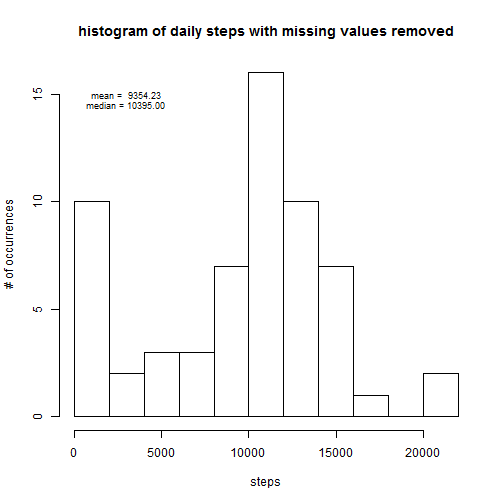
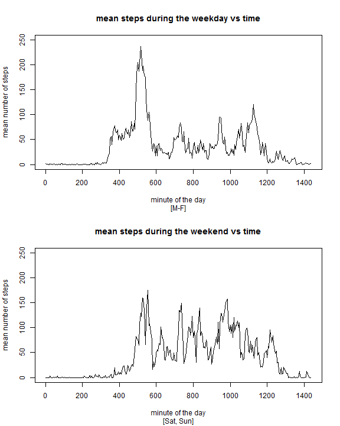

Loading Libraries
-----------------

```r
library(dplyr, warn.conflicts = FALSE)
```

```
## Warning: package 'dplyr' was built under R version 3.1.3
```

Loading and Formatting Data
---------------------------
Data formatting includes:  
   
*   converting the date to a day  
*   classifying the day as a weekday or weekend  
*   converting the interval to uniformly increasing time in minutes  


```r
xraw <- read.csv("activity.csv")
day <- weekdays(as.POSIXlt(xraw$date))
minutesOfTheDay <- (xraw$interval %% 100) + floor(xraw$interval / 100)*60
weekend <- (day == "Sunday" | (day == "Saturday"))
xdata <- cbind(xraw,day,minutesOfTheDay,weekend)
```
Histogram of Mean Steps 
-----------------------
**(Missing Values Removed)**

```r
totalStepsWithMissingValuesRemoved <- group_by(xdata, date) %>% summarize(steps = sum(steps, na.rm = TRUE))
dailyStepsWithMissingValuesRemoved <- totalStepsWithMissingValuesRemoved$steps[!is.na(totalStepsWithMissingValuesRemoved$steps)]
dailyStepsMean <- mean(dailyStepsWithMissingValuesRemoved)                # 9354.23
dailyStepsMedian <- median(dailyStepsWithMissingValuesRemoved)            # 10395.00

hist(dailyStepsWithMissingValuesRemoved, breaks = 8, xlab = "steps", ylab = "# of occurrences",
     main = "histogram of daily steps with missing values removed")
text(3000,15,sprintf("mean = %8.2f",dailyStepsMean),cex = 0.75)
text(3000,15,sprintf("median = %8.2f",dailyStepsMedian),cex = 0.75, pos = 1)
```

 

The mean number of steps taken during a day is **9354.23** steps.  

The median number of steps taken during a day is **10395.00** steps.  

Plot of Mean Steps vs Time 
--------------------------
**(Missing Values Removed)**

```r
meanTotalSteps <- group_by(xdata, minutesOfTheDay) %>% summarize(steps = mean(steps, na.rm = TRUE))

missingIntervals <- sum(is.na(xdata$steps))            # 2304 missing intervals
missingDays <- unique(xdata$date[is.na(xdata$steps)])  # 8 days with missing intervals

imax=which.max(meanTotalSteps$steps)
ymax=meanTotalSteps$steps[imax]        # 515 => 8:35
xmax=meanTotalSteps$minutesOfTheDay[imax]

plot(meanTotalSteps,type = "l", xlab = "minute of the day", ylab = "mean steps", main = "mean steps versus time")
text(xmax,ymax,
  sprintf("time of max steps = %2.0f:%2.0f",floor(xmax/60),xmax-floor(xmax/60)*60),
  cex = 0.75)
```

 

The maximum number of steps taken during a day occurs at **( 8:35 a.m. )**

Histogram of Mean Steps 
-----------------------
**(Missing Values Imputed)**  

There are **(2304 )** intervals with missing data. 

The missing intervals are distributed over **( 8 )** days.   


The algorithm used to impute the missing values is as follows:  
1.   construct a 2-D table (day x minutes) of the mean steps based on the available data  
2.   then, fill in missing values based on the (day,minute) of the missing value using the above table  


```r
meanTotalStepsTable <- group_by(xdata, day, minutesOfTheDay) %>% summarize(steps = mean(steps, na.rm = TRUE))

vindex <- which(is.na(xdata$steps))
vnew=((as.numeric(xdata$day[vindex])-1) * nlevels(as.factor(meanTotalStepsTable$minutesOfTheDay))) + 
     floor(xdata$minutesOfTheDay[vindex] / 5) + 1

xdata2 <- xdata
xdata2$steps[vindex] <- meanTotalStepsTable$steps[vnew]

totalStepsWithMissingValuesImputed <- group_by(xdata2, date) %>% summarize(steps = sum(steps))
dailyStepsWithMissingValuesImputed <- totalStepsWithMissingValuesImputed$steps
dailyStepsMean2 <- mean(dailyStepsWithMissingValuesImputed)             # 10821.21
dailyStepsMedian2 <- median(dailyStepsWithMissingValuesImputed)         # 11015.00

hist(dailyStepsWithMissingValuesImputed, breaks = 8, xlab = "steps", ylab = "# of occurrences",
     main = "histogram of daily steps with missing values imputed")
text(3000,15,sprintf("mean = %8.2f",dailyStepsMean2),cex = 0.75)
text(3000,15,sprintf("median = %8.2f",dailyStepsMedian2),cex = 0.75, pos = 1)
```

 

The mean number of steps taken during a day is **10821.21** steps.  

The median number of steps taken during a day is **11015.00** steps.  

The mean number of steps between the case of NA removed versus NA imputed is **noticeable**.  
Removing the missing values biases the number of steps lower than with the missing values imputed. 

Weekday vs Weekend Comparison 
-----------------------------
**(Missing Values Imputed)**

```r
weekdaySteps <- group_by(xdata2[xdata2$weekend == FALSE,], minutesOfTheDay) %>% summarize(steps = mean(steps))
weekendSteps <- group_by(xdata2[xdata2$weekend == TRUE,], minutesOfTheDay) %>% summarize(steps = mean(steps))

par(mfrow=c(2,1))
plot(weekdaySteps$minutesOfTheDay,weekdaySteps$steps,type="l",
     main="mean steps during the weekday vs time", sub="[M-F]",
     xlab="minute of the day", ylab="mean number of steps",
     xlim=c(0, 1440), ylim=c(0, 250))
plot(weekendSteps$minutesOfTheDay,weekendSteps$steps,type="l",
     main="mean steps during the weekend vs time", sub="[Sat, Sun]",
     xlab="minute of the day", ylab="mean number of steps",
     xlim=c(0, 1440), ylim=c(0, 250))
```

 

The mean number of steps during the weekday versus the weekend is **noticeable**.  
People's activities start later and end later during the weekend.  


